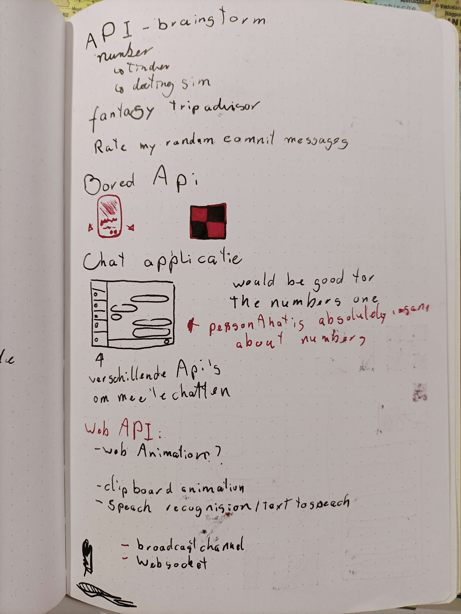
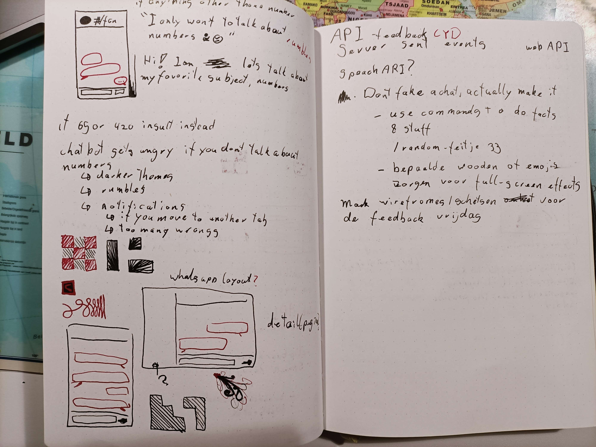
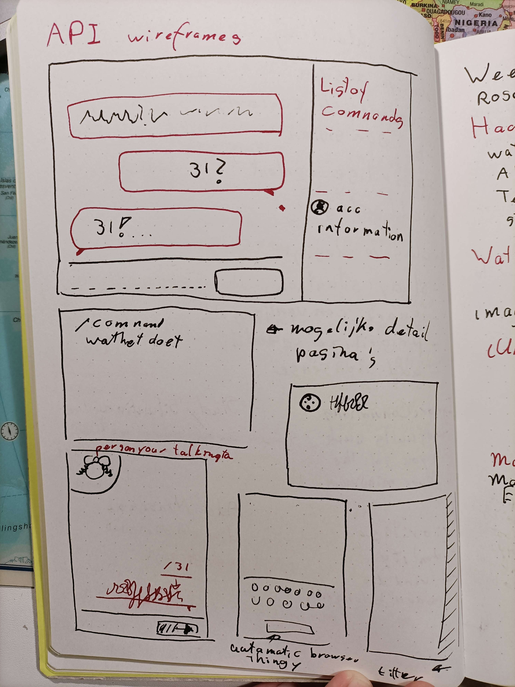
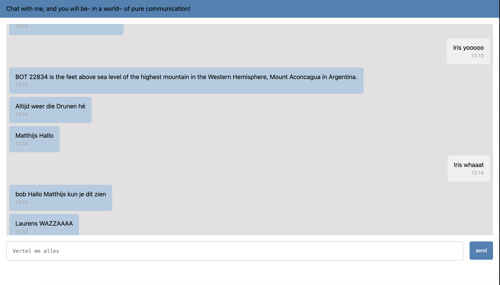
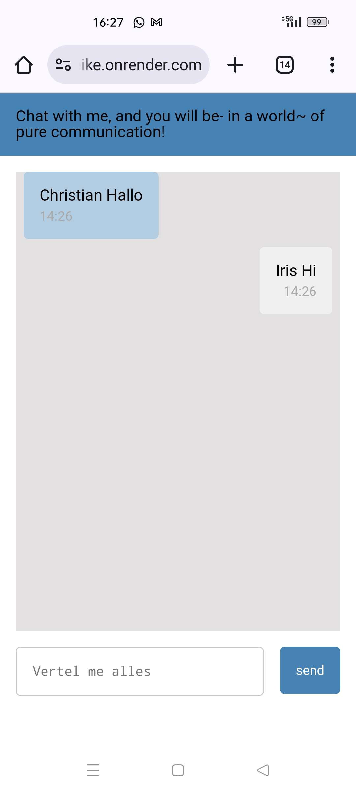
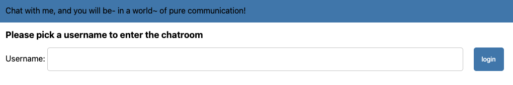

# Verslag API 24/25
Link online: https://api-ikreike.onrender.com/
## week 1
1. ideegeneratie 
Ik vond het best lastig om een idee te bedenken waar ik enthousiast voor werd. Ik denk dat ik hierdoor ook een best moeilijke opdracht heb uitgekozen. Ik had de content api die ik wou gebruiken al vrij snel gevonden, en omdat hij relatief simpel was is er juist heel veel mogelijk. Ik ben uiteindelijk geland op een chatapp met het gebruik van "commands" waarbij je de API kan aanroepen. Ik was zeer skeptisch ove het idee dat het ook daadwerkelijk online kon ipv het alleen maar na te maken, us ik ben blij verrast door het eindresultaat. 

content API: 
http://numbersapi.com/#52/trivia  

## week 2
2. bericht opslaan in array, arrayelementen inladen in html 
Het ontdekken van liquid was nog een klus en ik ben een aantal keer flink verdwaald geweest in de structuur van de bestanden. Het was heel fijn om een project als basis over te kunnen nemen en zo toch een deels nieuwe taal en syntax te kunnen ontdekken.
3. controleren op command, bericht vervangen door bericht van API (en ook met specifieke nummers!) 
Toen het was gelukt om dit te doen werd ik veel zelfverzekerder in de opdracht, aangezien het de eerste keer het idee had dat ik een stuk code zelf had geschreven (zonder op basis van een template te werken). Ik vind het heel leuk om gewoon met de API te spelen en te kijken wat voor feitje hij nu heeft. 
4. object maken van bericht voor meer informatie (tijd, ID) 
Ik had in week 1 gehoord dat het handig was om een object van het bericht te maken, maar het zonk pas later in waarvoor dat eigenlijk was. Ik vind dat een fijne manier van leren: Je leert iets omdat je het nodig hebt en gebruikt. Ik heb 3 elementen in het object gestopt: het bericht, het tijdstip, en het id van de gebruiker. De array zelf heb ik ingeladen in de html, waarna ik de objecten kon aanspreken en daadwerkelijk de verschillende stukjes informatie kan inladen en stylen. 

## week 3
5. Server-sent events API 
Ik heb deze week voor elkaar gekregen dat er een bericht vanuit de server te laten sturen op het moment dat er een bericht word verzonden vanuit een van de window, en dat die bij alle windows uitkomt. Dit is een goede eerste aanraking met de SSE API en het heeft me laten zien dat mijn idee ook mogelijk is. Ik heb verder ook een beetje gekloot met het doorsturen van informatie (de objecten uit de messages array) te versturen met het bericht, maar ik vind het lastig om te verzinnen hoe het bericht daarna opgevangen word.(maar het is wel gelukt)
6. dmv 'nep- id' een gesprek tussen 2 windows nabootsten. 
Het was echt leuk om te zien dat het werkte hier, want het was best lastig om hier te komen. In de laatste week is het natuurlijk fijn om het in het echt te kunnen doen, maar ik denk dat dit zeker presenteerbaar is. De ID is in deze stap gehardcode, en de client-side javascript zorgd ervoor dat de berichten zonder te herladen op de goede plek in de html komen. Het ID word veranderd als het bericht via de server mee word gegeven, en komt dus aan de andere kant. Dit geeft helaas het probleem dat zodra er herladen word alles aan de 'zelf verzonden' kant komt want het idee was alleen lokaal geupdate, en niet in de server. (probleem voor volgende week)
## week 4
  
7. Login pagina 
8. User ID en cookie API 
Grote dank aan Declan voor het helpen deze week. Ik merk aan mezelf dat ik de logica wel snap, maar het nog heel lastig vind om het zelf oplossingen te vinden. Het resultaat is heel gaaf geworden en het is me daarna ook gelukt om de username boven het bericht te krijgen voor nog een duidelijker berichtsysteem. Hoe het nu werkt is dat je als je binnenkomt zonder dat er een username in je cookies staat, je eerst naar de inlogpagina word gestuurd. Als je daar een naam invuld word je doorgestuurd naar de main page waar je username word gebruikt om te bepalen aan welke kant de berichten komen te staan. Namelijk je eigen kant (username matched met het id) of de andere kant (geen match met de username en het id). Dit word op de server gedaan dus zelfs na een refresh komen de berichten aan de goede kant. 

### conclusie
Het was echt heel gaaf om dit uiteindelijk werkend te krijgen. Nadat ik het online heb gezet heb ik met een groepje lopen chatten en de limieten van de chat getest. Er kunnen best veel verassende dingen, en het heeft me ideen gegeven wat ik er verder nog mee kan doen. 

## Huidige features
- /random-fact [number] command
- meerdere devices in 1 chatroom
- kan code schrijven in de chat (its not a bug its a feature)
- supported on mobile
- usernames
- cookie

## wat zou ik nog willen toevoegen/verbeteren
- image support 
Doordat het bericht direct in de html word gezet, zou ik kunnen checken of het bericht eindigd in een img indicatie (.jpeg, .png etc) en dan het bericht kunnen insluiten in een image tag "". Zo zou ik plaatjes kunnen renderen in the chatgroep.
- client-side javascript die op de server werkt 
De client-side javascript werkt momenteel helaas niet op de server, waardoor je met de hand moet refreshen om nieuwe berichten te zien en er niet automatisch gescrolld word. Dat is jammer en het verbeterd het leven veel.
- tijd 
Er is een kleine bug met de tijd, want als de minuten 1 getal zijn laat hij ook maar 1 getal zien. Dit zou ik kunnen oplossen door te checken op de hoeveelheid tekens in de huidige minuten en als het een 1 is er een 0 voor zetten. (13:8 => 13:08). Ook word de tijd gebruikt van waar de server staat, en niet de tijd waar de gebruiker is.
- commands 
Ik zou wel eindeloos kunnen doorgaan met leuke commands verzinnen 
- typing state 
Het zou mogelijk kunnen zijn om met sse events een event af te sturen waarbij er vermeld word of een gebruiker aan het typen is.
- <b>colored names </b>  
Het zou nuttig zijn als elke gebruiker een eigen (gerandomiseerde?) kleur heefd in zijn naam duidelijker te maken wie wie is
- <b> speech to text </b> 
Dat zou toch cool zijn? Ook een extra API

### bronnen
Content API: 
http://numbersapi.com/#52/trivia

Web API (server-sent event):
https://developer.mozilla.org/en-US/docs/Web/API/Server-sent_events/Using_server-sent_events

Web API (cookie):
https://www.npmjs.com/package/@tinyhttp/cookie?activeTab=readme

Logic trouble:
https://stackoverflow.com/questions/175739/how-can-i-check-if-a-string-is-a-valid-number

server-side:
https://github.com/fdnd-task/server-side-rendering-server-side-website/blob/main/server.js

server sent events tryout code: 
https://developer.mozilla.org/en-US/docs/Web/API/Server-sent_events/Using_server-sent_events

Server sent events uitleg: 
https://www.youtube.com/watch?v=4HlNv1qpZFY 

hoe krijg je de site online: 
https://github.com/fdnd-task/connect-your-tribe-profile-card/blob/main/docs/visitekaartje-met-nodejs.md#visitekaartje-integreren-en-live-testen

used for the scroll sticking to the bottom: 
https://stackoverflow.com/questions/18614301/keep-overflow-div-scrolled-to-bottom-unless-user-scrolls-up

En natuurlijk:
Declan,
Cyd en
chatgpt.
